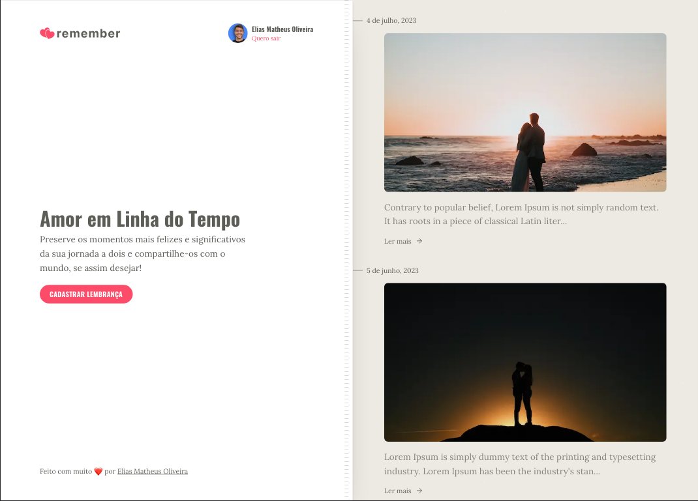

# remember

Um app voltado para casais que desejam guardar momentos especiais e lembranças de sua história e poder ver tudo isso em uma linha do tempo.

Este projeto da uma interface de usuário desenvolvida com React e Tailwind para a API de uma página de linha do tempo
Flask para a disciplina de **Desenvolvimento Full Stack Básico** do programa de pós-graduação em Desenvolvimento
Full Stack da [PUC-Rio](https://www.puc-rio.br/index.html).

## Screenshots

<div align="center">
  
</div>

<div style="clear: both; margin-bottom: 28px;"></div>

## Design da UI no Figma

Clique [aqui](https://www.figma.com/file/LzmrgQhMM9FRWNr9KKECdP/Remember?type=design&node-id=24%3A9431&mode=design&t=M1w0crDfKkarrZtB-1) para visualizar o design da UI no Figma.

---

## Technologias

- [React](https://reactjs.org/)
- [Next.js](https://nextjs.org/)
- [Tailwind](https://tailwindcss.com/)
- [Axios](https://axios-http.com/ptbr/docs/intro)

## Como executar

### Pré-requisitos

Antes de começar, você vai precisar ter instalado em sua máquina as seguintes ferramentas:
[Git](https://git-scm.com), [Node.js](https://nodejs.org/en/) e uma conta no [Github](https://github.com/).
Além disto é bom ter um editor para trabalhar com o código como [VSCode](https://code.visualstudio.com/)

### Rodando a aplicação

```bash
# Clone este repositório
$ git clone https://github.com/eliasmatheus/remember-app-web

# Acesse a pasta do projeto no terminal/cmd
$ cd remember-app-web

# Instale as dependências
$ npm install

# Execute a aplicação em modo de desenvolvimento
$ npm run dev

# A aplicação inciará na porta:3000 - acesse <http://localhost:3000/>
```

Abra o [http://localhost:3000/](http://localhost:3000/) para acessar a aplicação.

### Rodando o backend

Para rodar o servidor, acesse o repositório do [backend](https://github.com/eliasmatheus/remember-app-server) e siga as instruções.

### Conectando o frontend com o backend

Para conectar o frontend com o backend, é necessário criar um arquivo `.env.local` na raiz do projeto de acordo com o arquivo `.env.example` e preencher a variável `NEXT_PUBLIC_GITHUB_CLIENT_ID` com o client id do seu Github OAuth App.

Para conseguir um client id do Github OAuth App, siga as instruções [deste link](https://docs.github.com/pt/apps/oauth-apps/building-oauth-apps/creating-an-oauth-app).

> ⚠️ **Atenção**
>
> O campo `Authorization callback URL` deve ser preenchido com o endereço de autenticação da aplicação: `http://localhost:3000/api/auth/callback`.

Após criado, seu Client ID estará disponível na página do seu OAuth App. Copie e cole o valor do Client ID no arquivo `.env.local`:

```bash
NEXT_PUBLIC_GITHUB_CLIENT_ID=cole-aqui-o-client-id
```
